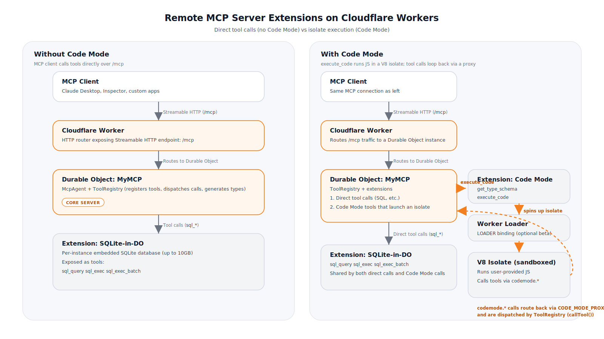

# Code Mode MCP Server (No Auth)

A remote MCP server on Cloudflare Workers implementing the **Code Mode** pattern — a generic compute + storage platform where AI agents connect via MCP, get typed APIs, and can execute code in sandboxed V8 isolates.

- **SQLite-in-DO** — Full SQL database per instance (up to 10GB, zero-latency)
- **Code Mode** — Execute JavaScript in sandboxed V8 isolates with typed tool access
- **No authentication** — Public access, ideal for development and private networks

## Get Started

[](https://deploy.workers.cloudflare.com/?url=https://github.com/QuentinCody/mcp-codemode-templates)

```bash
npm install
npm run dev
```

Server runs at `http://localhost:8788`
- Homepage: `http://localhost:8788/`
- MCP endpoint: `http://localhost:8788/mcp`

## Available Tools

### Storage (SQL)

| Tool | Params | Description |
|------|--------|-------------|
| `sql_query` | `query`, `params?` | Execute SELECT/PRAGMA/EXPLAIN queries. Returns rows as JSON. |
| `sql_exec` | `query`, `params?` | Execute DDL/DML (CREATE TABLE, INSERT, UPDATE, DELETE). |
| `sql_exec_batch` | `statements` | Execute multiple DDL/DML statements in a single call. Much faster than calling `sql_exec` in a loop. |

Agents can create their own tables, indexes, and manage data entirely through SQL. Parameterized queries prevent injection. `sql_exec` and `sql_exec_batch` block ATTACH, DETACH, and LOAD_EXTENSION for safety.

### Compute (Code Mode)

| Tool | Params | Description |
|------|--------|-------------|
| `execute_code` | `code` | Execute JavaScript in a sandboxed V8 isolate with access to all tools via `codemode` object. |
| `get_type_schema` | (none) | Returns TypeScript type definitions for all tools, so agents can write well-typed code. |

## How Code Mode Works

1. **Agent calls `get_type_schema`** to get TypeScript definitions for all available tools
2. **Agent writes JavaScript code** using those types as a guide
3. **Agent calls `execute_code`** with the code string
4. **Code runs in a sandboxed V8 isolate** with a `codemode` proxy object
5. **Tool calls in the isolate** (e.g., `codemode.sql_query(...)`) route back to the MCP server
6. **Results return** to the agent

### Example Flow

```
Agent → get_type_schema()
Agent ← TypeScript definitions

Agent → execute_code({
  code: `
    await codemode.sql_exec({
      query: "CREATE TABLE IF NOT EXISTS notes (id INTEGER PRIMARY KEY, title TEXT, body TEXT)"
    });
    await codemode.sql_exec({
      query: "INSERT INTO notes (title, body) VALUES (?, ?)",
      params: ["Hello", "World"]
    });
    const notes = await codemode.sql_query({ query: "SELECT * FROM notes" });
    return notes;
  `
})
Agent ← [{ id: 1, title: "Hello", body: "World" }]
```

> **Note:** Worker Loader API may require Cloudflare beta access. The `execute_code` tool will gracefully error if the LOADER binding isn't available. All other tools work independently of Code Mode.

## Connect with MCP Inspector

```bash
npx @modelcontextprotocol/inspector
```

Enter `http://localhost:8788/mcp` as the MCP server URL.

## Connect with Claude Desktop

Add to your Claude Desktop config (`Settings > Developer > Edit Config`):

```json
{
  "mcpServers": {
    "codemode": {
      "command": "npx",
      "args": ["mcp-remote", "http://localhost:8788/mcp"]
    }
  }
}
```

## Deploy to Cloudflare

```bash
npm run deploy
```

Then update Claude Desktop config to use your deployed URL:
```
https://remote-mcp-server-authless.<your-account>.workers.dev/mcp
```

## Architecture



```
┌─────────────────────────────────────────────────────────────────┐
│  MCP Client (Claude Desktop, Inspector, etc.)                   │
└──────────────────────────┬──────────────────────────────────────┘
                           │ Streamable HTTP (/mcp)
                           ▼
┌─────────────────────────────────────────────────────────────────┐
│  Cloudflare Worker (HTTP Router)                                │
│  src/index.ts                                                   │
└──────────────────────────┬──────────────────────────────────────┘
                           │ Routes to Durable Object
                           ▼
┌─────────────────────────────────────────────────────────────────┐
│  MyMCP (Durable Object)                                         │
│  src/mcp-shared/agent.ts                                        │
│                                                                 │
│  ┌───────────────────────────────────────────────────────────┐  │
│  │  ToolRegistry                                             │  │
│  │  Registers tools, routes isolate calls, generates types   │  │
│  └──────┬──────────────────────────────────┬─────────────────┘  │
│         │                                  │                    │
│         ▼                                  ▼                    │
│  ┌──────────────┐                   ┌──────────────────────┐   │
│  │  SQLite-in-DO │ ◄── Extension 1  │  Code Mode           │   │
│  │              │                   │                      │   │
│  │  sql_query   │                   │  execute_code        │   │
│  │  sql_exec    │                   │  get_type_schema     │   │
│  │  sql_exec_   │                   └──────────┬───────────┘   │
│  │    batch     │                              │               │
│  │              │                              │ Worker Loader  │
│  │  Embedded    │                              ▼               │
│  │  SQLite DB   │                   ┌──────────────────────┐   │
│  │  (up to 10GB)│                   │  V8 Isolate          │   │
│  │              │                   │  (sandboxed)         │   │
│  │  this.sql    │                   │                      │   │
│  │  tagged      │                   │  User code runs here │   │
│  │  template    │                   │  with `codemode`     │   │
│  │              │                   │  proxy object        │   │
│  └──────────────┘                   └──────────┬───────────┘   │
│         ▲                                      │               │
│         │              ┌───────────────────┐   │               │
│         │              │  CodeModeProxy    │◄──┘               │
│         │              │  (service binding)│  RPC call         │
│         │              └────────┬──────────┘                   │
│         │                       │ Routes back to DO            │
│         │                       ▼                              │
│         └───── registry.handleIsolateCall() ───────────────────│
│                (tool call completes, result returns to isolate) │
└─────────────────────────────────────────────────────────────────┘
```

### How the pieces fit together

- **MCP Server (core)** — The `MyMCP` Durable Object extends Cloudflare's `McpAgent` class. It hosts the MCP protocol, manages sessions, and owns the `ToolRegistry` that all tools register into.

- **Extension 1: SQLite-in-DO** — Each DO instance has an embedded SQLite database accessible via `this.sql` (a tagged template literal). The SQL tools (`sql_query`, `sql_exec`, `sql_exec_batch`) provide safe, parameterized access with statement validation.

- **Extension 2: Code Mode** — Sandboxed JavaScript execution via Cloudflare's Worker Loader API. User code runs in an ephemeral V8 isolate with a `codemode` proxy object. Tool calls inside the isolate (e.g., `codemode.sql_query(...)`) route through `CodeModeProxy` (a self-referencing service binding) back into the DO's `ToolRegistry`, which dispatches to the appropriate tool handler. Results flow back to the isolate.

- **Self-contained template** — Includes a vendored copy of the shared runtime in `src/mcp-shared/` so Deploy-to-Workers can build directly from the repo

## Customization

Tools are defined in `src/mcp-shared/tools/`. To add new tools:

1. Create a new file in `src/mcp-shared/tools/`
2. Export a `ToolEntry[]` array (see `src/mcp-shared/tools/sql.ts` for the pattern)
3. Register the tools in `src/mcp-shared/agent.ts` in the `init()` method via `this.registry.add(...yourTools)`

The registry automatically handles MCP registration, isolate call routing, and type generation — no manual `callTool()` cases needed. Tool definitions for type generation come from `registry.getDefinitions()`.
